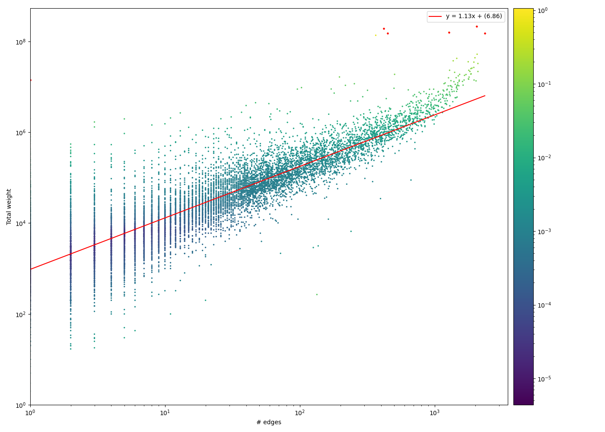

# OddBall Anomalies

Python3 implementation of the OddBall anomaly detection algorithm, proposed in the paper by Akoglu L., McGlohon M., Faloutsos C.(2010) oddBall: Spotting Anomalies in Weighted Graphs. This implementation is able to find egonet features in parallel, speeding up computations significantly. It provides the user with a visualisation of the results, mirroring the plots seen in the paper.

## Installation

Make sure you have Python 3 (tested with v3.8) and install dependencies using the following command:

```
pip install -r requirements.txt
```

## Usage

The `oddball.py` script can be used to detect anomalies in a graph. It required a `tsv`, weighted edge-list file as input with the following format:

```
node1<tab>node2<tab>weight
```

You can point to this file using the `--graph` flag. The anomaly types that can be detected are Stars/Cliques (`sc`), Heavy Vicinities (`hv`), and Dominant Edges (`de`). This can be specified using the `--anomaly_type` flag. The algorithm only uses the distance to the fitting line as the anomaly score by default. Including the `--lof` flag also included the Local Outlier Factor score described in the paper. The number of processes used during the feature extracting process can be set by using the `--processes` flag. The `--group` flag can be used to specify which group you want to investigate in the case of bipartite graphs.

An example usage would be:

```
python oddball.py --graph <path_to_graph> --anomaly_type sc --lof --processes <no_processes>
```

By default, the values of the `node1` and `node2` fields are used for the node names. You can submit separate node name files by using the `--id_names` flag. This can be a list of files in the case of a bipartite graph. For more info on the flags, use the `--help` flag.

## Example Output

After running the script, a plot will be created of the results:



## Links

* Com2Cand / Don2Com dataset: http://download.srv.cs.cmu.edu/~mmcgloho/fec/data/fec_data.html
* OddBall original code: https://www.andrew.cmu.edu/user/lakoglu/pubs.html#oddball
